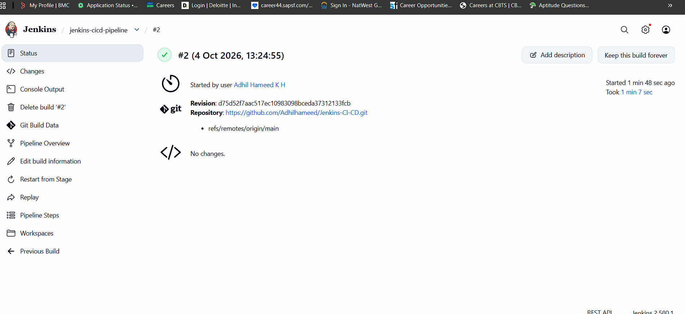
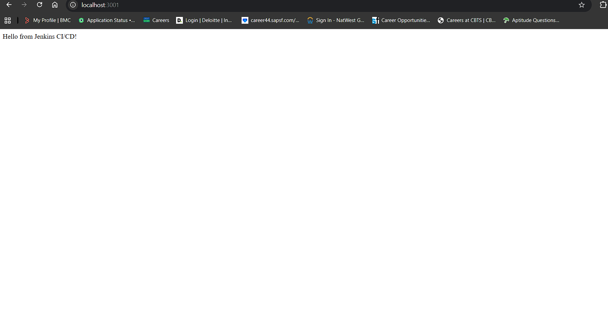

# Jenkins CI/CD Pipeline (Task 2, DevOps Internship)

A simple CI/CD pipeline that uses **Jenkins** and **Docker** to automatically build, test, and deploy a small Node.js (Express) app whenever code is pushed to GitHub.

## Tools Used
- Jenkins (LTS, running in a Docker container)
- Docker
- Node.js 18 / Express
- GitHub
- WSL2 on Windows

## Project Structure
| File | Purpose |
|---|---|
| `app.js` | Express app with `/` and `/health` endpoints |
| `test.js` | Test for the `/health` endpoint |
| `package.json` | Dependencies and `npm test` script |
| `Dockerfile` | Builds the app image |
| `Jenkinsfile` | Declarative pipeline definition |
| `screenshots/` | Proof of pipeline runs |

## Setup Steps
1. Ran Jenkins in Docker, mounting the host Docker socket so pipelines can run Docker commands:
```bash
   docker run -d --name jenkins --user root \
     -p 8080:8080 -p 50000:50000 \
     -v jenkins_home:/var/jenkins_home \
     -v /var/run/docker.sock:/var/run/docker.sock \
     jenkins/jenkins:lts
   docker exec -u root jenkins bash -c "apt-get update && apt-get install -y docker.io"
```
2. Unlocked Jenkins, installed the suggested plugins, and created an admin user.
3. Created a **Pipeline** job using *Pipeline script from SCM* (Git, branch `*/main`, script path `Jenkinsfile`).

## Pipeline Stages
1. **Checkout**: pulls the latest code from GitHub.
2. **Build**: builds the Docker image, tagged with the build number and `latest`.
3. **Test**: runs `npm test` inside the built image.
4. **Deploy**: removes the old container and starts the new one on port 3001.

## Trigger on Each Commit
The Jenkinsfile uses `pollSCM('H/2 * * * *')`, so Jenkins checks GitHub about every 2 minutes and starts a build when it finds a new commit.

## How I Tested It
1. Build #2 ran successfully and deployed the app at `http://localhost:3001`.
2. I changed the message in `app.js` and pushed to `main`.
3. Jenkins started build #3 automatically.
4. The app then returned `Hello from Jenkins CI/CD! Build v2`.

## Screenshots
**Stage view: green pipeline runs**


**Console output**


## Issues I Fixed
- **GitHub authentication:** passwords are not accepted, so I used a Personal Access Token.
- **Wrong file contents:** Dockerfile content had ended up in the Jenkinsfile, causing a Groovy syntax error. Rewriting the file fixed it.
- **Port conflict:** port 3000 was already in use, so the deploy maps host port 3001 to container port 3000.

## Interview Questions
**1. What is Jenkins, and how is it used in CI/CD?**
Jenkins is an open-source automation server. It builds, tests, and deploys code automatically when changes are committed.

**2. What is a Jenkinsfile?**
A text file in the repo that defines the pipeline as code (stages and steps), so it is versioned with the application.

**3. How do you create and configure Jenkins pipelines?**
Create a Pipeline job, point it at a repo containing a Jenkinsfile, and configure the trigger (webhook or Poll SCM), credentials, and plugins.

**4. What are some common stages?**
Checkout, Build, Test, Code Quality/Scan, Package, Deploy, Notify.

**5. Declarative vs scripted?**
Declarative uses a structured `pipeline { }` syntax that is simpler and easier to read. Scripted uses Groovy `node { }` blocks, which are more flexible but more complex.

## What I Learned
How to run Jenkins in Docker, write a declarative Jenkinsfile, trigger builds from Git commits, and automate build, test, and deployment of a containerized app.
